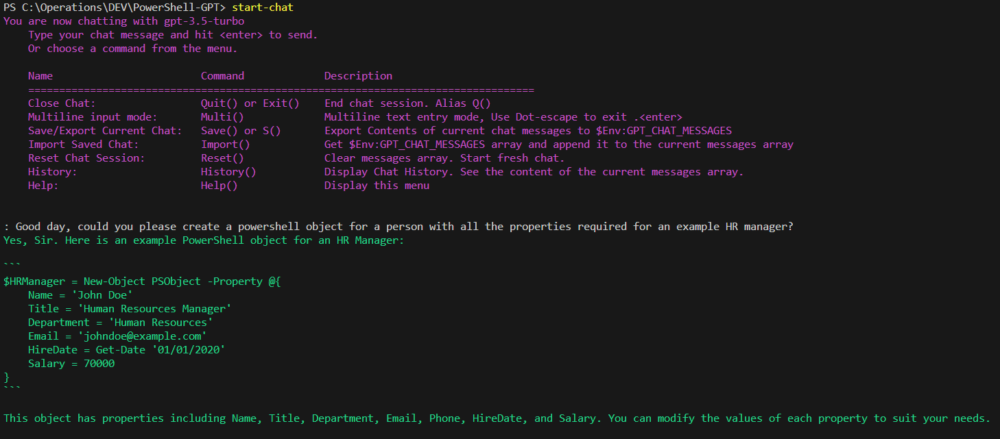
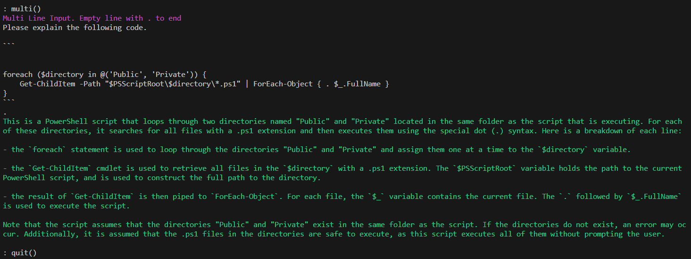
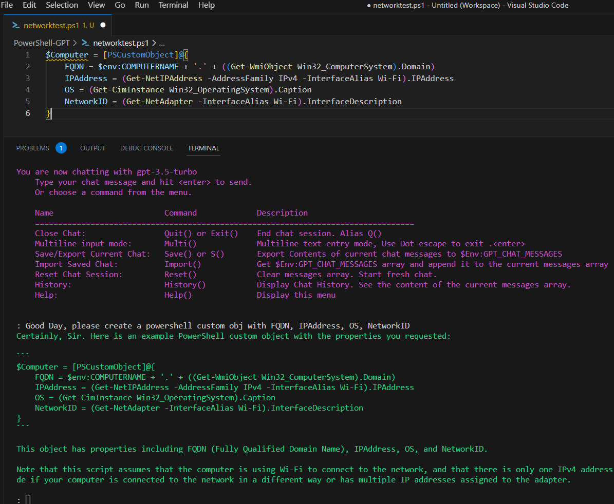
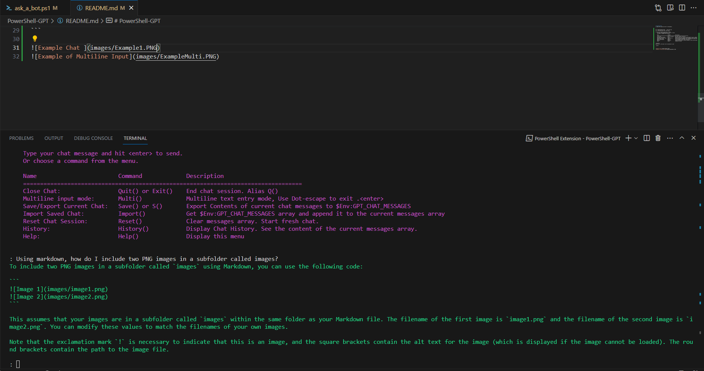

# PowerShell-GPT - an OpenAI Chat for PowerShell. v0.5.3
A simple ChatGPT powered chat for PowerShell.

https://github.com/Ross-Murphy/PowerShell-GPT


### Questions.

What is this?
---
Simply import the PowerShell module and you can call up a simple command line chat interface with OpenAI ChatGPT to help with whatever you like. Add the module command to your PowerShell profile and you will always have it ready to go. 

This started off as a way to have a simple coding and virtual assistant inside VSCode or in my other PowerShell task windows. 
I did not initially find an extension for VsCode to my liking. Also I thought it would be fun to code something like this and it only took a few hours of innovation time. 


What's Next
---
There are several other PowerShell OpenAI ChatGPT API scripts out there and honestly if I had found them first I may not have started this at all, however it was fun and I like the simplicity of it all. This needs to become a proper module if it's to be distributed as a project. 
Eventually I would like to add some ability for the chat to interact with the shell in a limited capacity. Using the new Functions array in released in gpt-3.5-turbo-0613.

What's New?
---
---
v0.5.3
---
Setup and Config Handling
- Reading config file will detect version mismatch and force setup wizard.

- Change Setup function to allow accepting default or current options making in quicker to change settings without more input.

- Changed the setup and config process to allow changing between model with a menu.
For example gpt-3.5-turbo-16k has 4 times the chat context size however prices per token are higher as well. 
This somewhat addresses Issue: [#1](https://github.com/Ross-Murphy/PowerShell-GPT/issues/1) Where longer chats or large conversational context causing an error. 

- Add Debugging option to Global Config . The ability to turn on extra messages like debugging that will show token count and other verbose output. use `Setup()`

Added new menu command aliases
- `Q()` for save and quit. Now you can drop back to the shell and then when back in chat import the save with `I()`
- `M()` shorthand for `Multi()` Multiline input mode.
---
Bugs Fixed

v0.5.3

 - [Previous version of config file causes upgrade setup failure ](https://github.com/Ross-Murphy/PowerShell-GPT/issues/17)

v0.5.2
- Added support for OpenAI GPT-4 models 'gpt-4' & gpt-4-32k

    Supported models are now
    - 'gpt-3.5-turbo' # Default 
    - 'gpt-3.5-turbo-16k'
    - 'gpt-4'
    - 'gpt-4-32k'

    [See the OpenAI API diverse set of models](https://platform.openai.com/docs/models)

- Typo in model selection menu causing error

v0.5.1
- Various Bugfixes 
    - Issue [#2](https://github.com/Ross-Murphy/PowerShell-GPT/issues/2)
 Non ascii characters returned by the API would cause an error if re-submitted by the message array with out proper handling.
--------------

## Examples
Great for generating boilerplate code or getting started on something.
---


Single and multiline support.
---


Very Handy in the terminal window in VsCode.
---




How to Get Started?
---
Get an API key from your OpenAI Account https://platform.openai.com/account/api-keys

Clone the repository 
`git-clone https://github.com/Ross-Murphy/PowerShell-GPT.git`

Import Module.
`Import-Module -Name \path-to\PowerShell-GPT\PowerShell-GPT.psm1`

Run `Start-Chat` to kick off the setup for first time.

Cross Platform Support
---
As of version 0.4 this should run anywhere that runs PowerShell 7.x on Linux or Windows etc.

How to use?
---
Adding the module import command to your PowerShell Profile is handy.

In PS terminal window substitute `code` for your preferred editor.
`code $PROFILE`

In this example below you can add it to your profile and use it in VsCode

In the vscode PS terminal window 
`code $PROFILE`

add the following adjusting for your own path to your location where you git cloned the repo.
```powershell
Import-Module -Name /path-to/PowerShell-GPT.psm1 -Force
```

When you next login and the module is loaded you simply run `start-chat` to get started.


```
start-chat

    You are now chatting with gpt-3.5-turbo.  Type your chat message and hit <enter> to send.
    Or choose a command from the menu.
---
GPT-PowerShell Version 0.5
==================================================================================
Name                        Command             Description
==================================================================================
Close Chat:                 Quit() or Exit()    End chat session. Alias Q() is Save and Quit.
Multiline input mode:       Multi() or M()      Multiline text entry mode, Use Dot-escape to exit .<enter>
Save/Export Current Chat:   Save() or S()       Export Contents of current chat messages to $Env:GPT_CHAT_MESSAGES
Import Saved Chat:          Import() or I()     Import content of $Env:GPT_CHAT_MESSAGES & append to current messages array.
Reset Chat Session:         Reset()             Clear messages array. Start fresh chat.
History:                    History()           Display Chat History. See Content of current messages array.
Config:                     Conf()              Display Current Configuration.
Setup:                      Setup()             Setup  config options. API-Key, system_msg, model context, debug msg
Help:                       Help()              Display this help menu.

: Good Day.         
Good day, Sir. How may I be of assistance to you?

: quit()
```

Setup
---
Run `start-chat` Note: The first time it will run `Setup()`. You will get prompted to configure your API key. 
If you want to run the setup again at any time you can always run  `Start-PowerShellGPTSetup` in PowerShell
Or alternatively you can use `Setup()` from the chat command menu.

The setup creates a configuration directory in user home dir called `.PowerShell-GPT` and stores and loads the config in a json file stored there.

### Reference Material
[https://platform.openai.com/docs/introduction](https://platform.openai.com/docs/introduction)

[https://platform.openai.com/docs/api-reference](https://platform.openai.com/docs/api-reference)

License
---
MIT